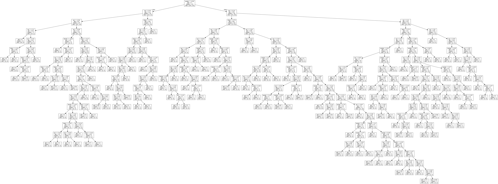
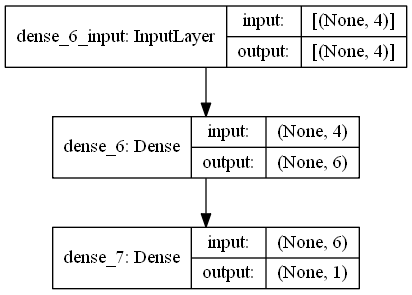

# Mammographic-Masses
A case study of comparing accuracies of different supervised classification algorithms for the Mammographic masses dataset provided by [UC, Irvine](https://archive.ics.uci.edu/ml/datasets/Mammographic+Mass). 

## Problem
Mammography is the most effective method for breast cancer screening available today. However, the low positive predictive value of breast biopsy resulting from mammogram interpretation leads to approximately 70% unnecessary biopsies with benign outcomes. To reduce the high number of unnecessary breast biopsies, several computer-aided diagnosis (CAD) systems have been proposed in the last years. These systems help physicians in their decision to perform a breast biopsy on a suspicious lesion seen in a mammogram or to perform a short term follow-up examination instead.

## Dataset
The dataset contains 961 instances of masses detected in mammograms, and contains the following attributes:
* BI-RADS assessment: 1 to 5 (ordinal)
* Age: Patient's age in years (integer)
* Shape: Mass shape: (round = 1, oval = 2, lobular = 3, irregular = 4) (nominal)
* Margin: Mass Margin: (circumscribed=1 microlobulated=2 obscured=3 ill-defined=4 spiculated=5) (nominal)
* Density: Mass Density: (high=1 iso=2 low=3 fat-containing=4) (ordinal)
* Severity: benign=0 or malignant=1 (binominal)

Ignoring BI-RADS as it is _NOT_ a predictive attribute

## Objective
* To clean, normalise the data and predict whether the mass is malignant or benign using different supervised classification techniques.
* To see which one yields the **HIGHEST** accuracy as measured with K-Fold cross validation (K = 10).

## Results
After running various classifiers, the accuracies are as follows:
* Decision Trees - 73.09%
* Random Forest - 79.28%
* SVM (linear kernel) - 79.64%
* SVM (polynomial kernel) - 79.27%
* SVM (RBF kernel) - 80.12%
* K Nearest Neighbours - 79.40% (for k = 7) tested upto k = 30
* Naive Bayes - 78.44%
* Logistic Regression - 80.73%
* Neural Network (Keras) - 80.21%

Clearly, all except decision tree have an average accuracy in the range of 79-80%

## Outputs
Below is the decision tree created. Output generated by python's Graphviz:

Below is the Neural Network model, generated with Keras' plot_model

### References
This case study is part of the final project for [this](https://www.udemy.com/data-science-and-machine-learning-with-python-hands-on/) Udemy course.
